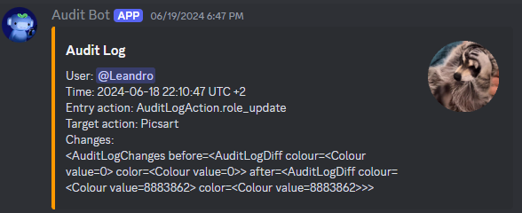

# AuditLogBot
Audit Log Bot for Discord

Add an .env file and put the Bot Token and Channel ID
```env
TOKEN=BOT_TOKEN
CHANNEL_ID=YOUR_CHANNEL_ID
```

## How it looks



## Commands

| Command | Syntax |
|---|---|
| ?ignore | ?ignore @user |
| ?unignore | ?unignore @user |
| ?list | ?list |
